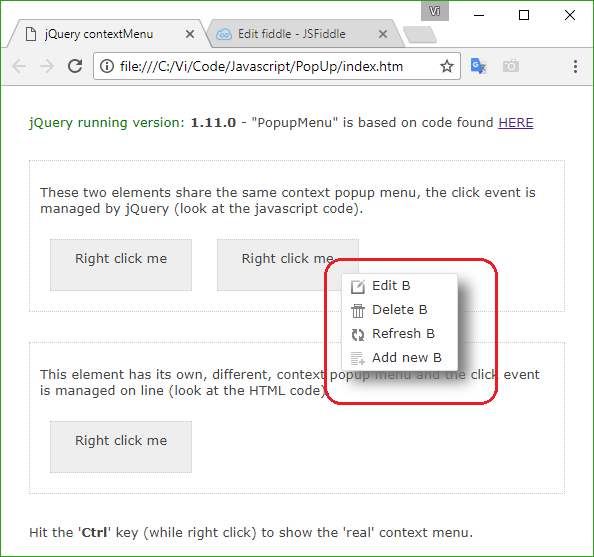
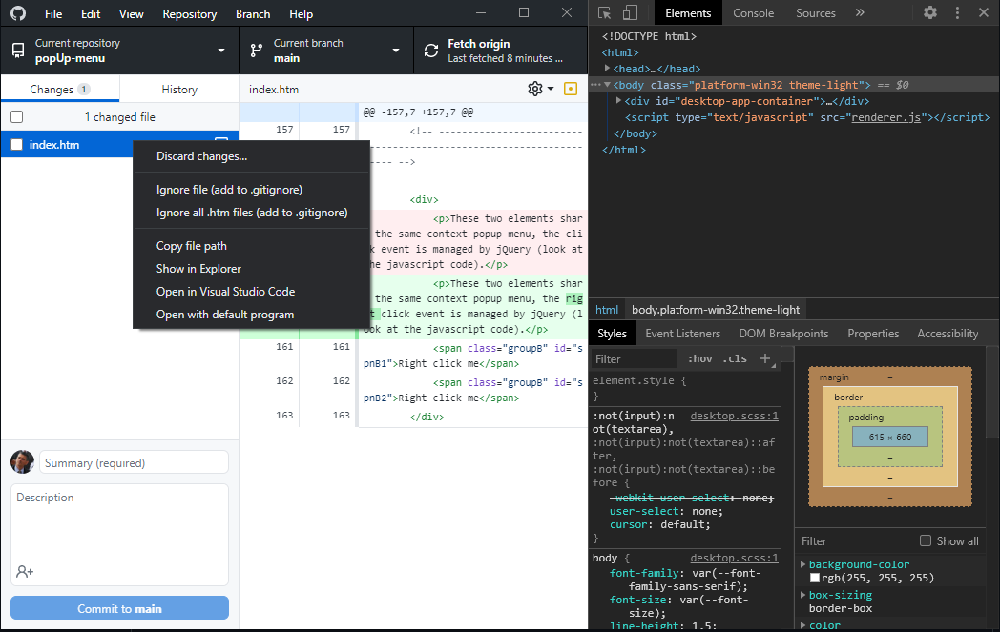

# popUp-menu
This project provides a js 'engine' to manage a one layer popUp menu.  
 
One important feature, to improve the 'user experience', is the permanence of the menu for a little while after the mouse left (accidentally) it.  
 

<!--  -->
<!-- # Format:  -->

 
Developers, in general and web developers in particular, tend not use popUps. 
They should! Especially when developing intranet or desktop applications. 
 
The below image shows the popUp of the 'GitHub desktop' application, which believe or not is an HTML page (as shown by the right panel: 'Developer tools'). 
 

<!--  -->

